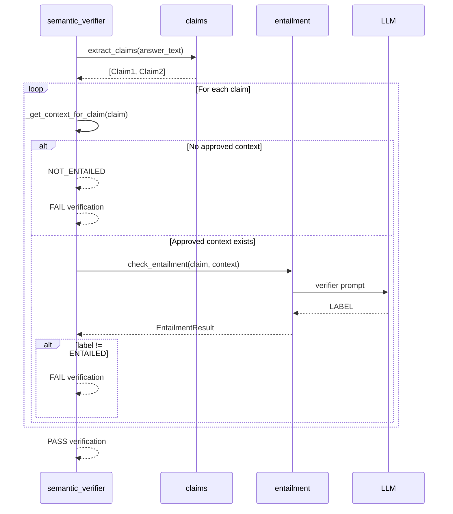

# Day 6 — Semantic Validation (Claim ↔ Context Entailment)

This repository contains **Day 6** of the **RAG from First Principles** project.

Day 6 introduces a **semantic validation layer** that enforces a strict guarantee:

> **Every factual claim in an answer must be fully supported (entailed) by approved context.**

This prevents hallucinations, unsupported statements, and citation misuse in Retrieval-Augmented Generation (RAG) systems.

---

## 🎯 Objective

To build a *fail-closed* semantic verifier that:

- Extracts factual claims from an answer
- Checks each claim against retrieved context
- Fails the answer if **any claim** is unsupported

The LLM is used **only as a semantic verifier**, never as a source of truth.

---

## 🧱 High-Level Flow

### Overall Pipeline

```
┌────────────┐
│  Answer    │
│  Text      │
└─────┬──────┘
      │
      ▼
┌────────────┐
│ Claim      │
│ Extraction │  (claims.py)
└─────┬──────┘
      │  List[Claim]
      ▼
┌────────────┐
│ Approved   │
│ Context    │  (ContextPack)
└─────┬──────┘
      │  per-claim filtering
      ▼
┌────────────┐
│ Entailment │
│ Check      │  (entailment.py + LLM)
└─────┬──────┘
      │  EntailmentResult
      ▼
┌────────────┐
│ Verification│
│ Report     │  (semantic_verifier.py)
└────────────┘
```

Actor sequence for a single answer:

User / System | |  answer\_text ▼ semantic\_verifier.verify\_answer | |-- extract\_claims(answer\_text) |       → [Claim1, Claim2, ...] | |-- for each Claim: |       | |       |-- \_get\_context\_for\_claim(claim) |       |       → approved\_chunks only |       | |       |-- if no context → FAIL (NOT\_ENTAILED) |       | |       |-- check\_entailment(claim, context) |       |       | |       |       |-- build prompt |       |       |-- call LLM |       |       |-- parse LABEL |       |       | |       |       → EntailmentResult |       | |       |-- if label != ENTAILED → FAIL | |-- all claims ENTAILED ▼ VerificationReport(passed=True)

```

---

## 🔁 Sequence Diagram (Claim-Level Verification)

Below is a **clean, readable step-by-step sequence** for how a single answer is verified.

### Textual Sequence (Easy to Read)

```
1. verify_answer(answer_text)

2. extract_claims(answer_text)
   → [Claim A, Claim B, ...]

3. For each Claim:

   3.1 _get_context_for_claim(claim)
       → approved_chunks only

   3.2 If approved_chunks is empty:
       → create EntailmentResult(label=NOT_ENTAILED)
       → return VerificationReport(passed=False)

   3.3 check_entailment(claim, approved_chunks)
       → build verifier prompt
       → call LLM
       → parse LABEL strictly
       → EntailmentResult

   3.4 If label != ENTAILED:
       → return VerificationReport(passed=False)

4. If all claims are ENTAILED:
   → return VerificationReport(passed=True)
```

---

### Mermaid Sequence Diagram (GitHub-renderable)



---

## 📦 Core Modules

### `claims.py` — Claim Extraction

**Purpose**
- Extract atomic factual claims from an answer

**Rules**
- One claim per factual statement
- Sentence-based splitting
- Ignore non-factual language (opinions, hedging)
- No truth evaluation at this stage

**Example**

```

Answer: "Refunds are processed within 5–7 business days. Refunds are instant."

Claims:

1. Refunds are processed within 5–7 business days.
2. Refunds are instant.

````

---

### `entailment.py` — Claim ↔ Context Entailment

**Purpose**
- Determine whether a single claim is fully supported by context

**Key Properties**
- Uses ONLY provided context
- No prior knowledge allowed
- Strict output labels:
  - `ENTAILED`
  - `NOT_ENTAILED`
  - `UNKNOWN`

**Safety Rules**
- Instruction text is never parsed
- Malformed responses fail closed
- Only exact labels are accepted

---

### `semantic_verifier.py` — Answer Verification

**Purpose**
- Verify that *all* claims in an answer are entailed

**Logic**
For each claim:
1. Use **approved chunks only**
2. If no approved context → fail
3. Run entailment check
4. If label ≠ `ENTAILED` → fail immediately

The answer passes **only if every claim is entailed**.

---

## 📄 Verification Output

Each verification produces a structured report:

```python
VerificationReport(
    passed: bool,
    claim_results: List[EntailmentResult],
    failure_reason: Optional[str]
)
````

Each `EntailmentResult` contains:

- Claim text
- Entailment label
- Rationale
- Supporting chunk IDs

This enables audits, debugging, and UI integration.

---

## 🚨 Day‑6 Invariants (Critical)

These rules are enforced by tests and code:

1. Every factual claim is extracted
2. Dropped chunks are never used as evidence
3. No approved context → automatic failure
4. Only `ENTAILED` is acceptable
5. `UNKNOWN` and `NOT_ENTAILED` both fail
6. No silent skips or defaults
7. Fail fast, but always record results

> **Fail‑closed by design**

---

## 🧪 Test Coverage

Day 6 is fully test-driven.

Covered scenarios include:

- All claims entailed → pass
- Any claim not entailed → fail
- No approved context → fail
- Dropped chunks ignored
- Mixed factual and non-factual answers
- Empty answers
- Malformed LLM responses

Tests enforce *behavioral guarantees*, not implementation details.

---

## 🧠 Why This Matters

With Day 6 complete, the RAG system now guarantees:

- No hallucinated facts
- No unsupported claims
- Explainable failures
- Audit-friendly verification

This semantic validation layer is reusable across:

- Enterprise RAG systems
- Policy and compliance assistants
- AML / risk analysis pipelines

---

## ✅ Status

✔ **Day 6 Complete**\
✔ All tests passing\
✔ Invariants enforced

---

## ➡️ Next Steps

- Day 7: Claim ↔ Citation Alignment
- Refactor Days 1–6 into a reusable validation core
- Production hardening (metrics, thresholds, UI)

---

**Day 6 — Semantic Validation is complete and frozen.**

